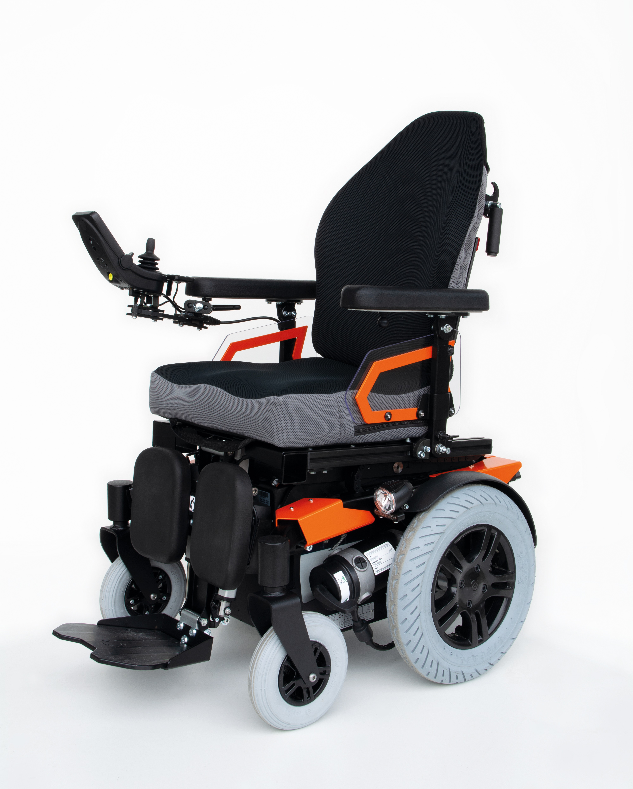
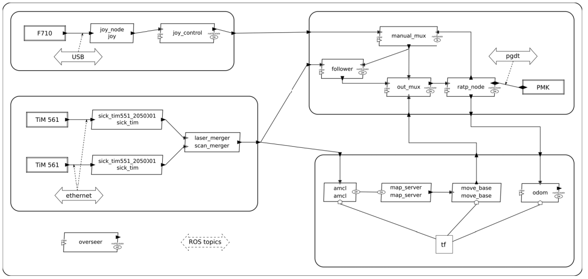
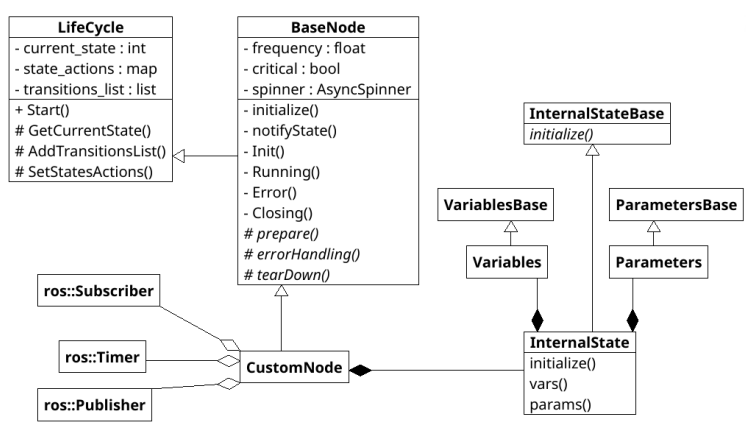
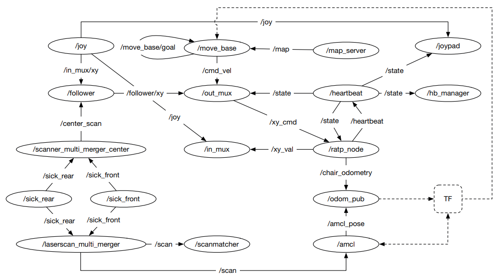
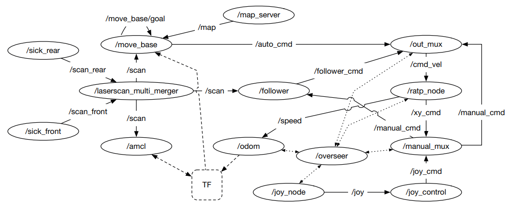
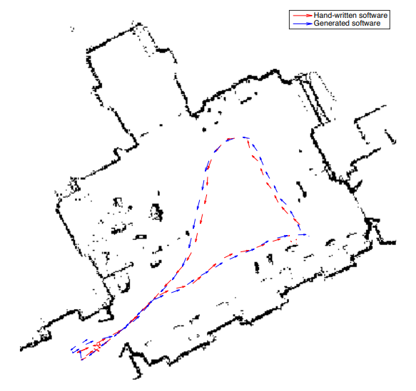

<!-- _class: title -->
Gianluca Bardaro, Andrea Semprebon e Matteo Matteucci

# A use case in model-based robot development using AADL and ROS

2018

 Ana Barbosa

---

## Resumo

O artigo demonstra AADL para uma abordagem baseada em modelos para separar e aprimorar o desenvolvimento, dividindo as funções de engenheiros de software e especilistas em robótica.

---
<!-- _class: style_b -->

## 1. Introdução

Rôbos são sistemas complexos. Eles são o resultado da cooperação de diversas áreas. Entretanto, não existe suporte para essa cooperação.

A arquitetura de software dos robôs são sistemas baseasdos em componentes distríbuidos. O middleware mais usado é o ROS, composto por Nodes e Topics.

> _"We don’t wrap your main."_

---
<!-- _class: style_b -->

Porém, a liberdade que ROS oferece, não é mais sustentável atualmente.

A proposta é criar uma descrição de uma arquitetura de robô baseada em modelos e usar isso para análise de arquiterura, com AADL, e geração de código automática.

---

## 2. A Plataforma

O robô utilizado é a cadeira de rodas elétrica **Twist T4 2x2**, 
modificada para controle por computador.

O sistema que converte ela para uma plataforma robotíca 
é o _Personal Mobility Kit_ (PMK), equipado com:

- motor encoders
- laser scanner distance sensors
- on-board PC

O PMK possui os seguintes modos de controle:
- Manual, PMK desligado
- Manual, mediado pelo PMK
- Assistido
- Autônomo

---
<!-- _class: style_b -->

## 3. O Modelo

---
<!-- _class: style_b -->

O modelo representa as quatro principais partes do robô: _teleoperation, sensing, navegation_ e _platform_.

Com isso, o sistema principal fica divido em subsistemas, o que é útil para a abstração da arquitura, apesar de não ser necessário.

No sistema principal há dois componentes: o _overseer_, que gerencia o estado global do sistema, e o _ROS Topics_, que representa a infraestrutura de comunicação do ROS.

---

## 4. A Implementação de Nós

---

**LifeCycle** não está ligado aos nós do ROS. Ele possui uma lista de pares de estados (origem e destino), esses estados são vinculados métodos ou funções que são executados após a transição de estado.

**ROSNode** implementa o básico para nós ROS, associando métodos aos estados criando um ciclo de vida. Sendo eles: **Init, Running, Closing e Error.**

Isso além de

---
<!-- _class: style_b -->

## 5. Geração de Código

Para a geração do código com base no modelo, os Nós são divididos em três grupos existentes, customizados e especiais.

**Existentes**: são modelados apenas pelas suas interfaces (tópicos e serviços). O gerador não cria código para eles, mas os inclui na arquitetura.

**Customizados**: são totalmente descritos no modelo AADL e têm seu código C++ gerado automaticamente.

**Especiais:** Alguns Nós não podem ser totalmente gerados automaticamente. Mesmo assim, eles são modelados em AADL e adaptado manualmente, aproveitando a estrutura gerada.

---

## 6. Comparação de Arquiteturas

No geral, a arquitetura baseada em modelos se mostra equivalente nos resultados em comparação com a arquitetura feita a mão, com a vantagem de redução de erros e geração de código.

Dentre os problemas principais estão:

- Conexões desnecessárias
- Dependência circular nos Nós
- Nõs redundantes e desconectados.

Por exemplo, o `heartbeat node` envia o estado para muitos Nós que, praticamente, não usavam essa informação.

---

- Arquitetura Original

---

- Arquitetura Baseada em Modelo

---

Por fim, foi feito um teste de tragetória em 
modo autonomo entre o código gerado e 
escrito a mão.

Os caminhos se mostram equivalentes.

---

## 7. Discussões

### Geração de Código

Existe muitas soluções para gerar código para o ROS .automáticamente.

Mathlab possui o Robotics System Toolbox, que gera C++ com base em modelos Simulink, porém é muito verboso.

SmartSoft, uma abordagem orientada a serviços baseada em componentes, é baseada em DSL que pode ser usada como ponto de partida.

Há outros, como C-Forge e RoCK.

---

### Desenvolvimento de Sofware Robótica

O trabalho tem como objetivo criar uma solução mais próxima dos desenvolvedores e especialistas, e não a solução definitiva para desenvolvimento de software robótico.

A AADL proporcina a análise de sistemas de baixo nível e modelagem de componentes de hardware. O próximo passo seria analise de recursos (CPU, banda larga) para melhor integração com o software.

---
## Comentários

O artigo traz um caso de uso muito interresante, apesar de não se aprofundar na AADL. O trabalho busca melhorar a experiência de desevolvimento de software robótico.

---
<!-- _class: style_c -->

## Referência

GIANLUCA BARDARO; SEMPREBON, A.; MATTEUCCI, M. **A use case in model-based robot development using AADL and ROS**. 28 maio 2018.
