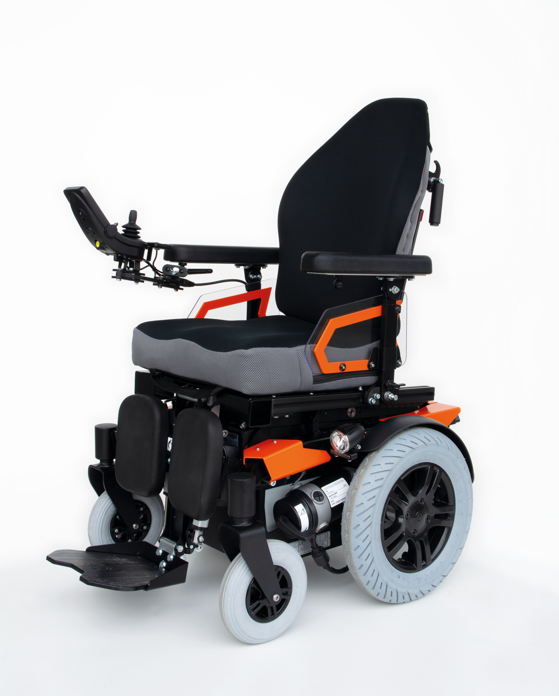
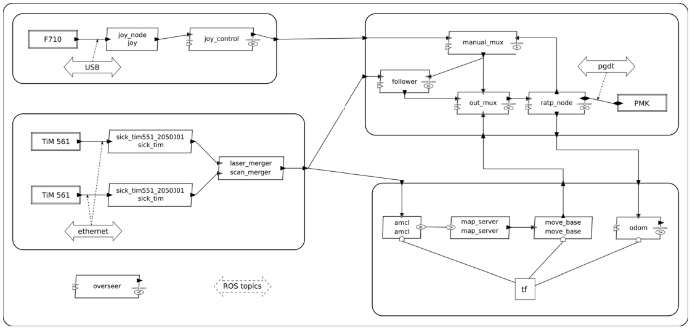
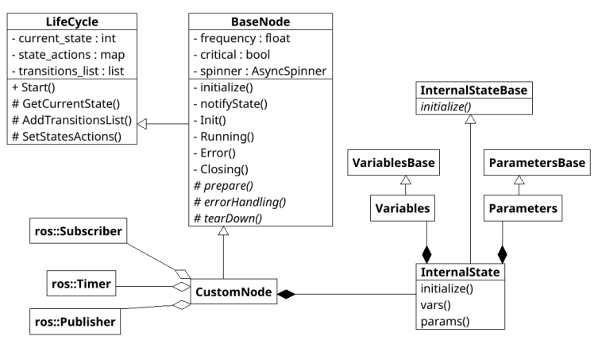
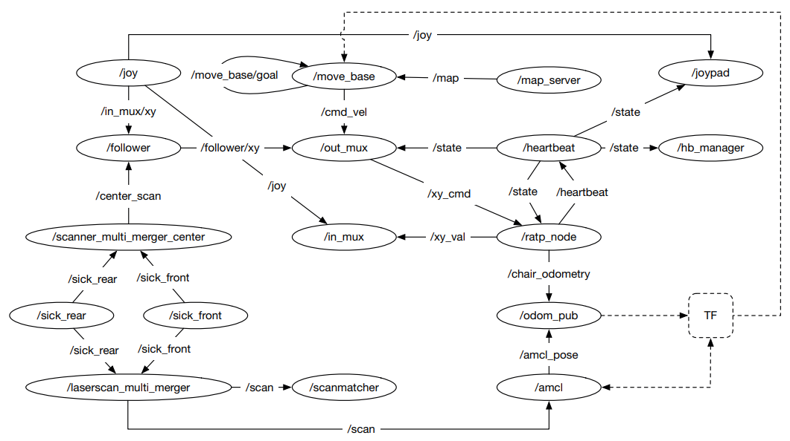
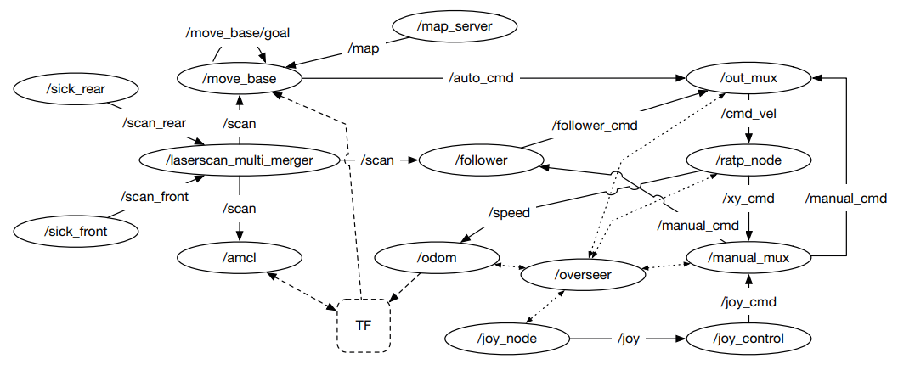
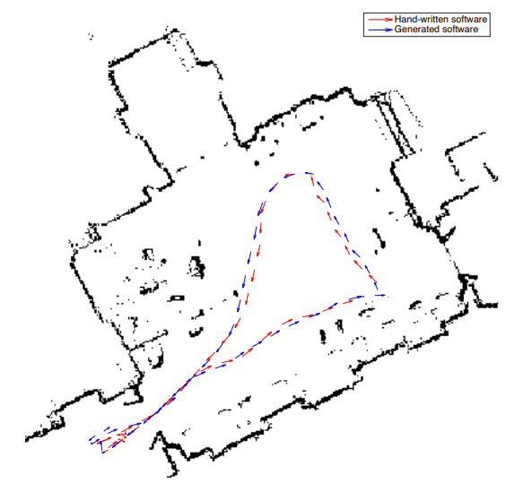

<!-- _class: title -->
Gianluca Bardaro, Andrea Semprebon e Matteo Matteucci

# A use case in model-based robot development using AADL and ROS

2018

 Ana Barbosa

---

## Resumo

O artigo demonstra o uso da AADL em uma abordagem baseada em modelos para separar e aprimorar o desenvolvimento, dividindo as funções de engenheiros de software e especialistas em robótica.

---

<!-- _class: style_b -->

## 1. Introdução

Robôs são sistemas complexos. Eles são o resultado da cooperação de diversas áreas. Entretanto, não existe suporte adequado para essa cooperação.

A arquitetura de software dos robôs é baseada em componentes distribuídos. O middleware mais utilizado é o ROS, composto por Nodes e Topics.

> _"We don’t wrap your main."_

---

<!-- _class: style_b -->

Porém, a liberdade que o ROS oferece não é mais sustentável atualmente.

A proposta é criar uma descrição de uma arquitetura de robô baseada em modelos e utilizá-la para análise de arquitetura, com AADL, e geração automática de código.

---

## 2. A Plataforma

O robô utilizado é a cadeira de rodas elétrica **Twist T4 2x2**,
modificada para controle por computador.

O sistema que a converte em uma plataforma robótica
é o _Personal Mobility Kit_ (PMK), equipado com:

- encoders dos motores
- sensores de distância a laser (_laser scanner_)
- computador embarcado (_on-board PC_)

O PMK possui os seguintes modos de controle:

- Manual, PMK desligado
- Manual, mediado pelo PMK
- Assistido
- Autônomo

---

<!-- _class: style_b -->

## 3. O Modelo

---

<!-- _class: style_b -->

O modelo representa as quatro principais partes do robô: _teleoperation_, _sensing_, _navigation_ e _platform_.

Com isso, o sistema principal fica dividido em subsistemas, o que é útil para a abstração da arquitetura, embora não seja estritamente necessário.

No sistema principal há dois componentes: o _overseer_, que gerencia o estado global do sistema, e o _ROS Topics_, que representa a infraestrutura de comunicação do ROS.

---

## 4. A Implementação dos Nós

---

**LifeCycle** não está ligado diretamente aos nós do ROS. Ele possui uma lista de pares de estados (origem e destino). Esses estados são vinculados a métodos ou funções que são executados após a transição de estado.

**ROSNode** implementa a base para os nós ROS, associando métodos aos estados e criando um ciclo de vida. Os estados são: **Init, Running, Closing e Error**.

Isso além de...

---

<!-- _class: style_b -->

## 5. Geração de Código

Para a geração de código com base no modelo, os nós são divididos em três grupos: existentes, customizados e especiais.

**Existentes:** são modelados apenas por suas interfaces (tópicos e serviços). O gerador não cria código para eles, mas os inclui na arquitetura.

**Customizados:** são totalmente descritos no modelo AADL e têm seu código C++ gerado automaticamente.

**Especiais:** alguns nós não podem ser totalmente gerados automaticamente. Mesmo assim, eles são modelados em AADL e adaptados manualmente, aproveitando a estrutura gerada.

---

## 6. Comparação de Arquiteturas

No geral, a arquitetura baseada em modelos se mostra equivalente em resultados quando comparada à arquitetura desenvolvida manualmente, com a vantagem da redução de erros e da geração automática de código.

Dentre os principais problemas identificados estão:

- Conexões desnecessárias
- Dependências circulares entre nós
- Nós redundantes e desconectados

Por exemplo, o `heartbeat node` envia o estado para muitos nós que praticamente não utilizavam essa informação.

---

- Arquitetura Original

---

- Arquitetura Baseada em Modelo

---

Por fim, foi realizado um teste de trajetória em
modo autônomo entre o código gerado e o
código escrito manualmente.

Os caminhos se mostraram equivalentes.

---

## 7. Discussões

### Geração de Código

Existem muitas soluções para gerar código para o ROS automaticamente.

O Matlab possui o Robotics System Toolbox, que gera código C++ com base em modelos Simulink, porém o resultado é muito verboso.

O SmartSoft, uma abordagem orientada a serviços baseada em componentes, utiliza uma DSL que pode ser usada como ponto de partida.

Há outras alternativas, como C-Forge e RoCK.

---

### Desenvolvimento de Software Robótico

O trabalho tem como objetivo criar uma solução mais próxima dos desenvolvedores e especialistas, e não uma solução definitiva para o desenvolvimento de software robótico.

A AADL proporciona a análise de sistemas de baixo nível e a modelagem de componentes de hardware. O próximo passo seria a análise de recursos (CPU e largura de banda) para uma melhor integração com o software.

---

## Comentários

O artigo traz um caso de uso muito interessante, apesar de não se aprofundar na AADL. O trabalho busca melhorar a experiência de desenvolvimento de software robótico.

---

<!-- _class: style_c -->

## Referência

GIANLUCA BARDARO; SEMPREBON, A.; MATTEUCCI, M. **A use case in model-based robot development using AADL and ROS**. 28 maio 2018.