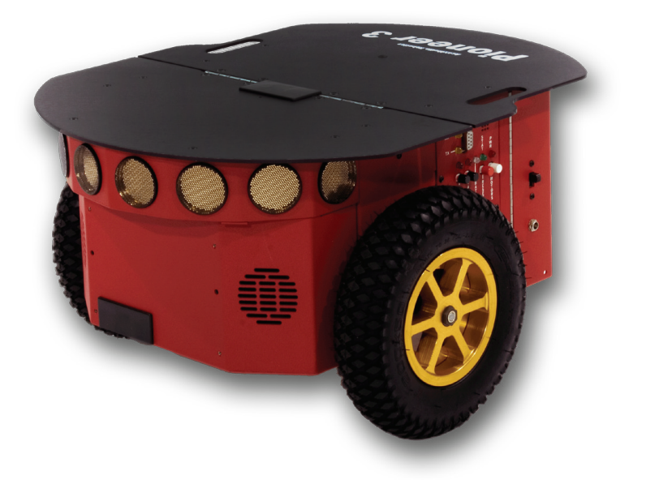

<style scoped>h1{font-size: 1.75em}</style>
<!-- _class: title -->
Eric Senn, Lucie W. J. Bourdon, Dominique Blouin

# Multi-Paradigm Modeling for early Analysis of ROS-based Robotic Applications using a Library of AADL Models

2022

<br>Ana Barbosa

---

## Resumo

O artigo mostra como fazer análise de arquitura usando o AADL para aplicações ROS.

Apresenta como foi feita a implementação de uma biblioteca de componentes AADl para o ROS com suporte muitas plataformas.

Mostra quais análises é possível observar nesse primeiro momento de implementação do ROS em uma plataforma robótica.

---
<!-- _class: style_b -->

## 1. Introdução

Aplicações robotícas são um conjunto de diferentes serviços, _Hardware_ e _Software_. 

Para confiar nesses serviços, análises iniciais são cruciais. 

Com AADL é possível analisar ambos os serviços, e desenvovedores de apliações ROS podem se beneficiar disso.

---
<!-- _class: style_b -->

**Robôs perfomam multiplas tarefas.**

O ROS está asscodiado com todas essas tarefas, transformando mensagens em _publishers_ e _subcribers_.


**ROS tem desvantagens**.

Sistemas embarcados são limitados e, por exemplo, rodar um middleware em cima do outro (ROS e DDS) é caro energeticamente.


--- 
<!-- _class: style_b -->

Para saber de qual serviço vem o problema é preciso entender:

  * **Software** como conjunto de Nós ROS.
  * **Hardware** são sensores, atuadores e placas embarcadas.
  * Vinculo entre serviços de software e recursos de hardware.

Para análise dos processos de CPU, barramento, tempo, latência, entre outros, a AADL é uma mão na roda.

---
<style scoped>img {position: absolute; right: 5%; bottom: 30%; border: 1px black solid;} p{width: 60%}</style>

## 2. A Biblioteca

Robôs mobile geralmente possuem duas placas de circuito.



* Um SoC para processar o ROS e seus Nós.

* Uma microcontroladora para gerenciar os atuadores.

Nós especificos são usados para troca de mensagenes entre elas. 


---

A biblioteca é organizada em quatro partes:

* **Pacote ROS principal** - Contém  definição dos tipos de comṕonentes e suas implementações, separando interfaces de entrada e saída.

* **Pacote de Nós** - Cada Nó possui um pacote proprío onde são definidos entrada, saída, os _theards_ e desempenhos medidos.

* **Pacote de Mensagens** - Definição de tipos de mensagens e implementações usadas na comunicação de Nós.

* **Pacote de Hardware** - Rôbos, placas, SoC's, CPU, etc.

---

A ideia é representar os Nós como _process_ da AADL, e seus _publishers_ e _subscribers_ como _threads_.

Usando a herança da OO da AADL, é possivel implementar componentes filhos com valores de desempenho associado a uma plataforma.

---

### Exemplo de Implementação

__Nó ROS__
```
process usb_cam_nd extends ros::node
features
  rgb_stream_in : in event data port ros_data::video_stream.rgb;
  rgb_image_raw_out : out event data port ros_data::Image.rgb;
end usb_cam_nd;

process implementation usb_cam_nd.impl
subcomponents
  image_broadcaster : thread imagePublisher.impl;
  usbSpinner : thread usb_cam_spinner.impl;
connections
  con1 : port image_broadcaster.pub_msg -> rgb_image_raw_out;
  con2 : port rgb_stream_in -> usbSpinner.rgb_stream_in;
end usb_cam_nd.impl;
```

---

__Publiser__
```
thread imagePublisher extends ros::publisher
features
  pub_msg : refined to out event data port ros_data::Image.rgb;
end imagePublisher;

thread implementation imagePublisher.impl
properties
  Period => 33333 us; -- @ 30 images/s
end imagePublisher.impl;
```

---

__Implementação - Plataforma Odroid XU4__
```
process implementation usb_cam_nd.xu4_a15 extends usb_cam_nd.impl
subcomponents
  image_broadcaster : refined to thread imagePublisher.xu4_a15;
properties
  SEI::MIPSBudget => 141.0 MIPS; -- (197 MIPS) / (1.4 IPC)
end usb_cam_nd.xu4_a15;

thread implementation imagePublisher.xu4_a15
  extends imagePublisher.impl
properties
  Compute_Execution_Time => 2319 us .. 2319 us;
  Queue_Size => 512 applies to pub_msg;
end imagePublisher.xu4_a15;
```
---

A ideia é representar os Nós como _process_ da AADL, e seus _publishers_ e _subscribers_ como _threads_.

Usando a herança da OO da AADL, é possivel implementar componentes filhos com valores de desempenho associado a uma plataforma.

---
<!-- _class: style_b -->

## 3. Análise dos Modelos AADL

A partir das implementações de modelos do sistema podemos fazer as seguintes análises.

* __Análise de Alocação de Recursos__ - Calculo de carga de CPU com base no tempo de execução e threads.

* __Análise de Orcamento de Recursos__ - Verifica se a soma das demandas de todas as threads de um processo respeita o MIPSBudget


--- 
<!-- _class: style_b -->

- __Análise de Carga de Barramento__ - Uso do barramento com base no tamanho das mensagens e frequência.

* __Escalonamento de Threads__ - Verifica estaticamente se as threads conseguem cumprir as tarefas no tempo esperado.

* __Análise em Tempo Real dos Threads__ - Simulaa execução real da tarefas, podendo revelar perda de prazo, mesmo quando a analise estatica diz que é escalonável.

---
<!-- _class: style_c -->

## Comentários

O artigo apresenta uma forma bem eficiente de se análisar diferentes plataformas robóticas utilizando-se de modelos da biblioteca criada.

Com muitos testes e implmentações de diferentes plataformas, a biblioteca se mostra bastante extensa.

Também é mostrado quais análises é possível fazer a partir dos modelos criados.

---

## Referência

ERIC SENN; LUCIE W. J. BOURDON; DOMINIQUE BLOUIN. __Multi-Paradigm Modeling for early Analysis of ROS-based Robotic Applications using a Library of AADL Models__. Outubro 2022.
