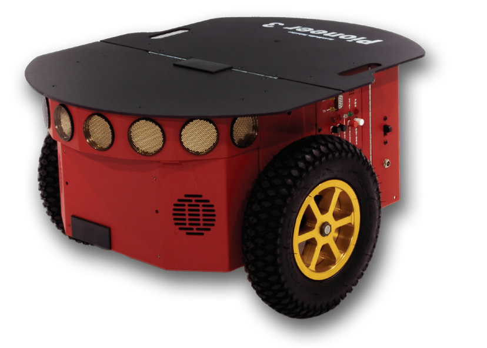

<style scoped>h1{font-size: 1.75em}</style>

<!-- _class: title -->

Eric Senn, Lucie W. J. Bourdon, Dominique Blouin

# Multi-Paradigm Modeling for Early Analysis of ROS-based Robotic Applications using a Library of AADL Models

2022

<br>Ana Barbosa

---

## Resumo

O artigo mostra como realizar análises de arquitetura utilizando AADL em aplicações ROS.

Apresenta como foi implementada uma biblioteca de componentes AADL para o ROS com suporte a múltiplas plataformas.

Também demonstra quais análises podem ser realizadas nesse estágio inicial da implementação do ROS em uma plataforma robótica.

---

<!-- _class: style_b -->

## 1. Introdução

Aplicações robóticas são compostas por diferentes serviços, hardware e software.

Para confiar nesses serviços, análises iniciais são cruciais.

Com AADL é possível analisar ambos, e desenvolvedores de aplicações ROS podem se beneficiar dessa capacidade.

---

<!-- _class: style_b -->

**Robôs executam múltiplas tarefas.**

O ROS está associado a todas essas tarefas, transformando mensagens em *publishers* e *subscribers*.

**O ROS possui desvantagens.**

Sistemas embarcados possuem recursos limitados e, por exemplo, executar um middleware sobre outro (ROS e DDS) tem um custo energético elevado.

---

<!-- _class: style_b -->

Para identificar a origem de um problema é preciso compreender:

* **Software** como um conjunto de nós ROS.
* **Hardware** composto por sensores, atuadores e placas embarcadas.
* O vínculo entre serviços de software e recursos de hardware.

Para análises de CPU, barramento, tempo, latência, entre outros aspectos, a AADL é uma ferramenta bastante útil.

---

<style scoped>img {position: absolute; right: 5%; bottom: 30%; border: 1px black solid;} p{width: 60%}</style>

## 2. A Biblioteca

Robôs móveis geralmente possuem duas placas de circuito.



* Um SoC para processar o ROS e seus nós.

* Um microcontrolador para gerenciar os atuadores.

Nós específicos são utilizados para realizar a troca de mensagens entre elas.

---

A biblioteca é organizada em quatro partes:

* **Pacote ROS principal** — Contém a definição dos tipos de componentes e suas implementações, separando interfaces de entrada e saída.

* **Pacote de Nós** — Cada nó possui um pacote próprio onde são definidos entrada, saída, *threads* e métricas de desempenho.

* **Pacote de Mensagens** — Definição dos tipos de mensagens e implementações utilizadas na comunicação entre nós.

* **Pacote de Hardware** — Robôs, placas, SoCs, CPUs etc.

---

A ideia é representar os nós como *processes* da AADL, e seus *publishers* e *subscribers* como *threads*.

Utilizando o mecanismo de herança da AADL, é possível implementar componentes derivados com valores de desempenho associados a uma plataforma específica.

---

### Exemplo de Implementação

**Nó ROS**

```aadl
process usb_cam_nd extends ros::node
features
  rgb_stream_in : in event data port ros_data::video_stream.rgb;
  rgb_image_raw_out : out event data port ros_data::Image.rgb;
end usb_cam_nd;

process implementation usb_cam_nd.impl
subcomponents
  image_broadcaster : thread imagePublisher.impl;
  usbSpinner : thread usb_cam_spinner.impl;
connections
  con1 : port image_broadcaster.pub_msg -> rgb_image_raw_out;
  con2 : port rgb_stream_in -> usbSpinner.rgb_stream_in;
end usb_cam_nd.impl;
```

---

**Publisher**

```aadl
thread imagePublisher extends ros::publisher
features
  pub_msg : refined to out event data port ros_data::Image.rgb;
end imagePublisher;

thread implementation imagePublisher.impl
properties
  Period => 33333 us; -- @ 30 images/s
end imagePublisher.impl;
```

---

**Implementação — Plataforma Odroid XU4**

```aadl
process implementation usb_cam_nd.xu4_a15 extends usb_cam_nd.impl
subcomponents
  image_broadcaster : refined to thread imagePublisher.xu4_a15;
properties
  SEI::MIPSBudget => 141.0 MIPS; -- (197 MIPS) / (1.4 IPC)
end usb_cam_nd.xu4_a15;

thread implementation imagePublisher.xu4_a15
  extends imagePublisher.impl
properties
  Compute_Execution_Time => 2319 us .. 2319 us;
  Queue_Size => 512 applies to pub_msg;
end imagePublisher.xu4_a15;
```

---

A ideia é representar os nós como *processes* da AADL, e seus *publishers* e *subscribers* como *threads*.

Utilizando o mecanismo de herança da AADL, é possível implementar componentes derivados com valores de desempenho associados a uma plataforma específica.

---

<!-- _class: style_b -->

## 3. Análise dos Modelos AADL

A partir das implementações dos modelos do sistema, podem ser realizadas as seguintes análises:

* **Análise de Alocação de Recursos** — Cálculo da carga de CPU com base no tempo de execução e nas *threads*.

* **Análise de Orçamento de Recursos** — Verifica se a soma das demandas de todas as *threads* de um processo respeita o valor definido em `MIPSBudget`.

---

<!-- _class: style_b -->

* **Análise de Carga de Barramento** — Avalia o uso do barramento com base no tamanho das mensagens e em sua frequência.

* **Escalonamento de Threads** — Verifica estaticamente se as *threads* conseguem cumprir suas tarefas dentro do tempo esperado.

* **Análise em Tempo Real das Threads** — Simula a execução real das tarefas, podendo revelar perda de prazos mesmo quando a análise estática indica que o sistema é escalonável.

---

<!-- _class: style_c -->

## Comentários

O artigo apresenta uma forma bastante eficiente de analisar diferentes plataformas robóticas utilizando os modelos da biblioteca criada.

Com diversos testes e implementações em diferentes plataformas, a biblioteca demonstra ser bastante abrangente.

Também são apresentadas as análises que podem ser realizadas a partir dos modelos desenvolvidos.

---

## Referência

ERIC SENN; LUCIE W. J. BOURDON; DOMINIQUE BLOUIN. **Multi-Paradigm Modeling for Early Analysis of ROS-based Robotic Applications using a Library of AADL Models**. Outubro de 2022.
