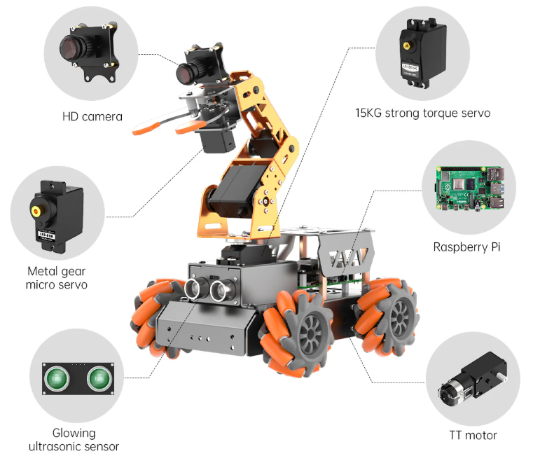
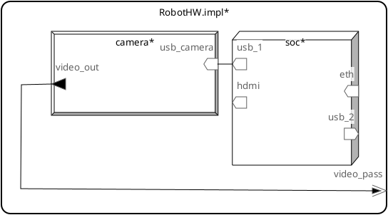
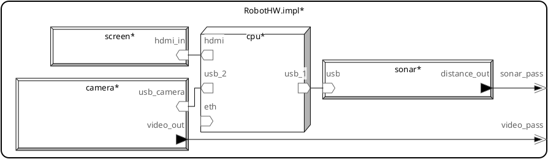

<!-- _class: title -->

<!-- Técnicas e Ferramentas para Modelagem e Análise de Comunicação em Sistemas Ciberfísicos -->

# Modelagem de Sistemas Ciberfísicos com AADL

Ana Barbosa, Wenderson Nascimento

---

## Abstração de Componentes

Na AADL, um componente é caracterizado por seu nome único e suas propiedades especifícias.

As abstrações de componentes são separados em três categorias:

- Software de Aplicação
- Plataforma de Execução (Hardware)
- Composto

---
<!-- _class: style_b -->

## Software de Aplicação

* **Thread**: Uma unidade escalonável de execução concorrente.
* **Thread Group**: Uma unidade composicional para organizar threads.

* **Process**: Um espaço de endereçamento protegido.

* **Data**: tipos de dados e dados estáticos no código-fonte.

* **Subprogram**: Código sequencial executável que pode ser chamado.

---

## Plataforma de Execução

* **Processor**: Componentes que executam _threads_.

* **Memory**: Componentes que armazenam dados e código.

* **Bus**:  Componentes que fornecem acesso entre os componentes da plataforma e execução.

* **Device**: Componentes que fazem interação com o ambiente externo.

---
<!-- _class: style_b -->

## Abstração de Sistema (Composto)
Um sistema composto de software, plataforma de execução, ou componentes de sistemas.

Podem representar sistemas complexos de sistemas, como a intregração de software e hardware de uma aplicação dedicada. Por exemplo, um sistema de vôo ou um banco de dados.

---

## Elementos Robóticos

Antes de abstrair um sistema, é necessário compreender seus elementos. No nosso caso, elementos robóticos.

* **Sensores** interpretam difenrentes aspectos do ambiente.
  _Ex_: Ultrasom, Câmeras

* **Atuadores** covertem energia armazenada em movimento.
  Podem ser hidráulicos, elétricos, ou pneumáticos.
  _Ex. Eletríco_: Servomotores

---
<!-- _class: style_b -->

## Exemplos de Abstração
<style scoped>img {position: absolute; left: 55%;}</style>



| Componente                        | Categoria AADL |
| --------------------------------- | -------------- |
| CPU _Cortex A72_                  | **Processor** |
| Raspberry Pi                      | **System** |
| Cartão SD                         | **Memory** |
| Motores, Servos                   | **Device** |
| Câmera, Ultrassom                 | **Device** |
| Baterias                          | **Device** |
| Cabos, USB                        | **Bus** |

---
<!-- _class: style_b -->

### Exemplo de Diagrama AADL

* Barramentos
  ```aadl
  bus USB
  end USB;

  bus Ethernet
  end Ethernet;
  ```
* Processador
  ```aadl
  processor SoC
    features
      eth   : requires bus access Ethernet
      usb_1 : provides bus access ;
      usb_2 : provides bus access ;
      hdmi  : provides bus access ;
  end SoC;
  ```

---
<!-- _class: style_b -->

- Dispositivos

  ```aadl
  device Camera
  features
    video_out  : out data port;
    usb_camera : requires bus access;
  end Camera;
  ```

* Sistema

  ```aadl
  system RobotHW
    features
      video_pass : out event data port;
  end RobotHW;
  ```

---
<!-- _class: style_b -->

- Implementação

  ```aadl
  system implementation RobotHW.impl
	subcomponents
		soc: processor SoC;
		camera: device Camera;

	connections
		conn1: feature camera.usb_camera -> soc.usb_1;
		conn2: port camera.video_out -> video_pass;
  end RobotHW.impl;
  ```

---
<!-- _class: style_b -->

### Diagrama Gerado pelo OSATE



---

**Implemetação Completa.**



---
<!-- _class: style_c -->
<style scoped>section { font-size: 24px; }</style>

## Referências

_The Architecture Analysis & Design Language (AADL): An Introduction._

_Multi-Paradigm Modeling for early Analysis of ROS-based Robotic Applications using a Library of AADL Models._

_Elements of Robotics._

_Robot Actuators: A Comprehensive Guide to Types, Design, and Emerging Trends_. https://www.wevolver.com/article/robotic-actuators-the-muscle-power-of-industry-40
