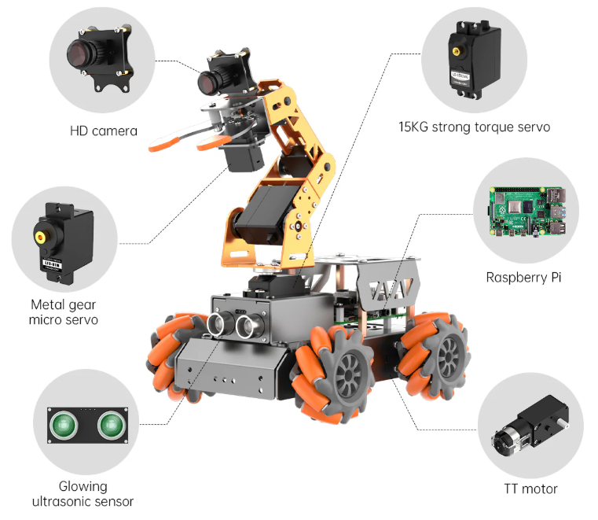
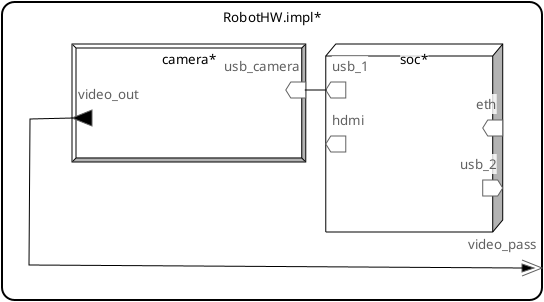
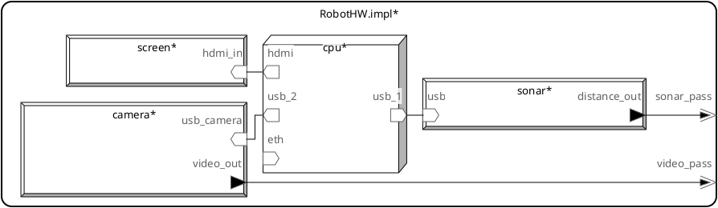

---

marp: true
title: Modelagem de CPS com AADL
author: Ana Barbosa, Wenderson Nascimento
keywords: ciberfisico, ros, aadl
theme: barbosa
class: style_a
paginate: true
_paginate: false
footer: 2025 © IFRN CNAT
---

<!-- _class: title -->

# Modelagem de Sistemas Ciberfísicos com AADL

Ana Barbosa, Wenderson Nascimento

---

## Abstração de Componentes

Na AADL, um componente é caracterizado por seu nome único e suas propriedades específicas.

As abstrações de componentes são separadas em três categorias:

- Software de Aplicação
- Plataforma de Execução (Hardware)
- Composto

---

<!-- _class: style_b -->

## Software de Aplicação

* **Thread**: uma unidade escalonável de execução concorrente.

* **Thread Group**: uma unidade composicional para organizar *threads*.

* **Process**: um espaço de endereçamento protegido.

* **Data**: tipos de dados e dados estáticos do código-fonte.

* **Subprogram**: código sequencial executável que pode ser chamado.

---

## Plataforma de Execução

* **Processor**: componentes que executam *threads*.

* **Memory**: componentes que armazenam dados e código.

* **Bus**: componentes que fornecem comunicação entre os componentes da plataforma de execução.

* **Device**: componentes que interagem com o ambiente externo.

---

<!-- _class: style_b -->

## Abstração de Sistema (Composto)

Um sistema composto por software, plataforma de execução ou outros componentes de sistema.

Pode representar sistemas complexos, integrando software e hardware em uma aplicação dedicada. Por exemplo, um sistema de voo ou um banco de dados.

---

## Elementos Robóticos

Antes de abstrair um sistema, é necessário compreender seus elementos. Neste caso, elementos robóticos.

* **Sensores** interpretam diferentes aspectos do ambiente.
  *Ex.:* ultrassom, câmeras.

* **Atuadores** convertem energia armazenada em movimento.
  Podem ser hidráulicos, elétricos ou pneumáticos.
  *Ex. elétrico:* servomotores.

---

<!-- _class: style_b -->

## Exemplos de Abstração

<style scoped>img {position: absolute; left: 55%;}</style>



| Componente        | Categoria AADL |
| ----------------- | -------------- |
| CPU *Cortex A72*  | **Processor**  |
| Raspberry Pi      | **System**     |
| Cartão SD         | **Memory**     |
| Motores, servos   | **Device**     |
| Câmera, ultrassom | **Device**     |
| Baterias          | **Device**     |
| Cabos, USB        | **Bus**        |

---

<!-- _class: style_b -->

### Exemplo de Diagrama AADL

* Barramentos

  ```aadl
  bus USB
  end USB;

  bus Ethernet
  end Ethernet;
  ```

* Processador

  ```aadl
  processor SoC
    features
      eth   : requires bus access Ethernet;
      usb_1 : provides bus access;
      usb_2 : provides bus access;
      hdmi  : provides bus access;
  end SoC;
  ```

---

<!-- _class: style_b -->

- Dispositivos

  ```aadl
  device Camera
  features
    video_out  : out data port;
    usb_camera : requires bus access;
  end Camera;
  ```

* Sistema

  ```aadl
  system RobotHW
    features
      video_pass : out event data port;
  end RobotHW;
  ```

---

<!-- _class: style_b -->

- Implementação

  ```aadl
  system implementation RobotHW.impl
    subcomponents
      soc    : processor SoC;
      camera : device Camera;

    connections
      conn1 : feature camera.usb_camera -> soc.usb_1;
      conn2 : port camera.video_out -> video_pass;
  end RobotHW.impl;
  ```

---

<!-- _class: style_b -->

### Diagrama Gerado pelo OSATE



---

**Implementação Completa**



---

<!-- _class: style_c -->

<style scoped>section { font-size: 24px; }</style>

## Referências

*The Architecture Analysis & Design Language (AADL): An Introduction.*

*Multi-Paradigm Modeling for Early Analysis of ROS-based Robotic Applications using a Library of AADL Models.*

*Elements of Robotics.*

*Robot Actuators: A Comprehensive Guide to Types, Design, and Emerging Trends.*
https://www.wevolver.com/article/robotic-actuators-the-muscle-power-of-industry-40
